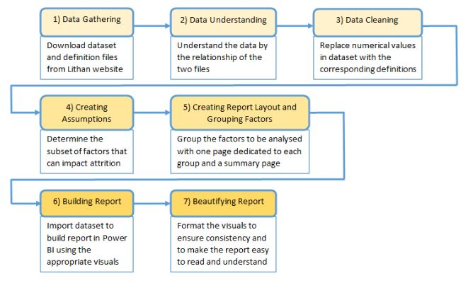
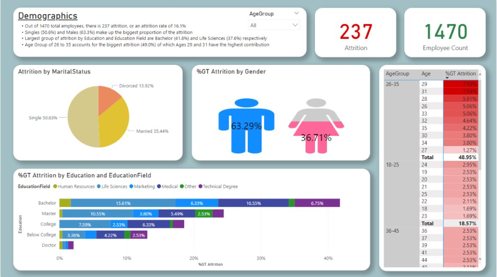
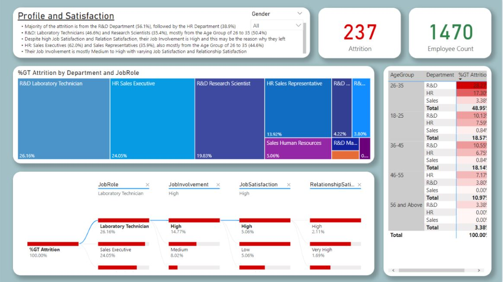
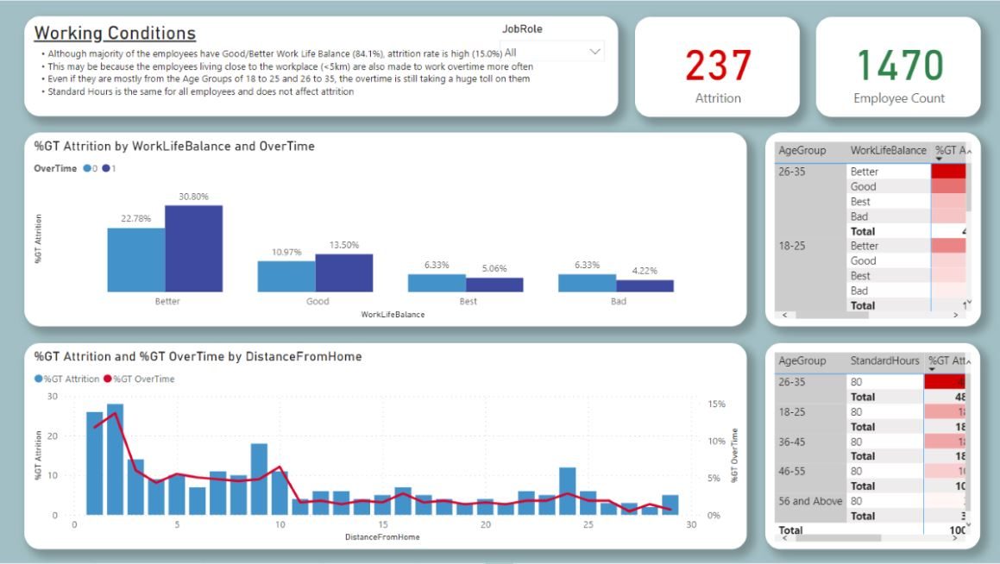
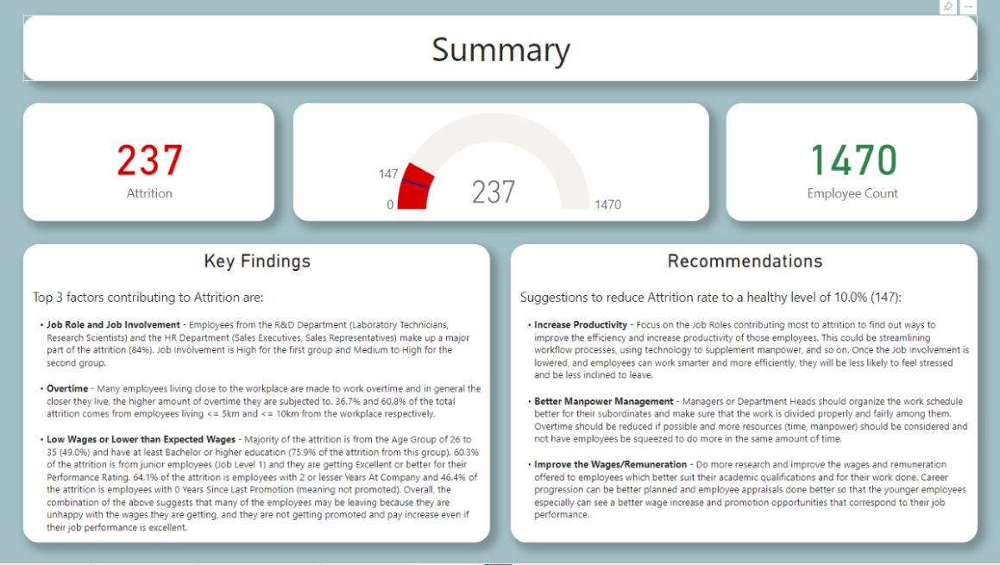

# HR Attrition
### Description  
In this project, analysis is performed on a set of data detailing employment records from an organization.

Data visualizations are created in Microsoft PowerBI to create a user-friendly report for the HR department of the organization.

The report provides analysis of the factors which are affecting attrition rate and gives conclusions and recommendations to minimize the attrition rate from 16 percent to a healthy rate (10 percent or less).

### Background
***Employee Attrition*** refers to the departure of employees from an organization for any reason (voluntary or involuntary), including resignation, termination, death, or retirement.

***Employee Attrition Rate*** refers to the percentage of the total employees that have left the company.

High attrition rate is bad for the organization as significant monetary investment is used for getting new hires to prepare them for performing their roles in the company. In addition, when experienced people leave, important skillsets are lost and gaps are created in the manpower which cannot be replaced easily or quickly.

In the analysis and creation of the report for the HR personnel, the aim is to provide key findings and recommendations so that they can reduce the attrition rate of the company to a healthier level (10% or less).

### Assets
- ***bennyng_cleaned_hr_attrition.xlsx*** (Final Excel file with cleaned data from the 2 source Excel files)
- ***images*** folder (Misc. image files)

### Sample Work
**Project Workflow**  

**PowerBI Report (some pages)**  

### Conclusion
A report is created using Microsoft PowerBI to analyse the employment data from an organization to provide insights to the high attrition rate experienced by the organization. Recommendations are given to help reduce the attrition rate to a healthier level.